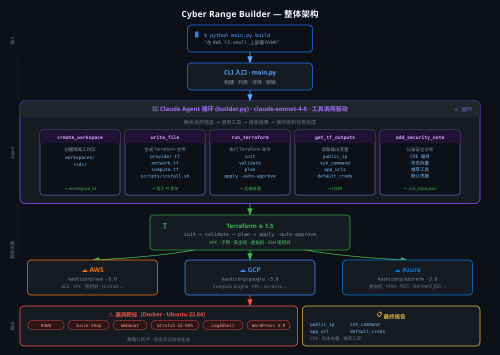

# Cyber Range Builder

AI 驱动的安全靶场自动构建工具，用于安全研究与培训。

用自然语言描述你想要的目标环境——Agent 自动生成 Terraform 配置、完成云端资源编排，并返回连接信息与安全分析注记。

> **仅供授权安全研究使用。** 生成的基础设施为故意配置漏洞的靶场环境。  
> 请始终部署在隔离的私有云账号中，使用完毕后及时销毁。

[English](README.md) | 中文

---

## 架构图



## 工作原理

```
你：   "在 AWS t3.small 上部署 DVWA"
Agent：生成 provider.tf、network.tf、compute.tf、scripts/install.sh
       → terraform init → validate → apply
       → 输出：public_ip、ssh_command、app_url、默认凭据
       → 安全注记：SQLi 入口、相关 CVE、推荐工具
```

Agent 基于 Claude 的工具调用循环，自动编写文件并执行 Terraform 命令。  
没有固定模板——Agent 根据你的描述灵活适配任意需求。

---

## 前置条件

| 工具 | 版本要求 |
|------|---------|
| Python | ≥ 3.11 |
| Terraform | ≥ 1.5 |
| Docker | 任意版本（运行在目标 VM 内，不需要在本机） |
| 云 CLI | aws / gcloud / az（需提前配置好凭据） |

---

## 快速开始

```bash
# 1. 克隆并安装依赖
git clone https://github.com/fxp/cyber-range-builder.git
cd cyber-range-builder
pip install -e .            # 或使用：uv pip install -e .

# 2. 配置环境变量
cp .env.example .env
# 编辑 .env，填写 ANTHROPIC_API_KEY 和云凭据

# 3. 构建靶标
python main.py build "在 AWS us-east-1 用 t3.small 部署 DVWA"

# 预览模式（不实际创建资源）
python main.py build "GCP 上部署 Apache Struts2 CVE-2017-5638" --dry-run

# 4. 查看已有靶场
python main.py list

# 5. 查看某个靶场的详细信息和安全注记
python main.py info <workspace_id>

# 6. 使用完毕后销毁
python main.py destroy <workspace_id>
```

---

## 请求示例

```
"DVWA on AWS t3.small，开放端口 80 和 22"
"GCP e2-medium 部署 OWASP Juice Shop，区域 europe-west1"
"AWS 上跑 WordPress 4.9 + MySQL 5.7，我要练习 SQLi 和认证绕过"
"AWS t3.micro 部署 Apache Struts 2 CVE-2017-5638，S2-045 RCE 实验"
"Azure Standard_B2s 上部署 WebGoat + WebWolf"
"AWS 搭建 Log4Shell CVE-2021-44228 演示环境"
"GCP 部署 Mutillidae II，开放端口 80 22 443"
```

---

## 项目结构

```
cyber-range-builder/
├── main.py                  # CLI 入口：build / list / destroy / info
├── agent/
│   ├── builder.py           # Claude Agent 主循环（工具调用驱动）
│   ├── tools.py             # 工具实现（写文件、运行 Terraform 等）
│   └── models.py            # Pydantic 数据模型
├── tf_templates/            # Terraform 参考模板（Jinja2）
│   ├── providers/           # aws / gcp / azure provider 配置
│   ├── network/             # VPC、子网、安全组
│   └── compute/             # VM 实例
├── app_scripts/             # 各靶标应用的 Docker 安装脚本
│   ├── dvwa.sh
│   ├── juice_shop.sh
│   ├── struts2_cve_2017_5638.sh
│   ├── wordpress_old.sh
│   ├── webgoat.sh
│   ├── mutillidae.sh
│   └── log4shell_cve_2021_44228.sh
├── docs/
│   └── workflow.md          # 完整构建流程文档（中文）
└── workspaces/              # 运行时生成（已加入 .gitignore）
    └── <workspace_id>/
        ├── provider.tf
        ├── variables.tf
        ├── network.tf
        ├── compute.tf
        ├── outputs.tf
        ├── scripts/install.sh
        └── .crb_state.json
```

---

## 添加新靶标

1. 在 `app_scripts/` 下新建安装脚本 `your_app.sh`
2. 在构建请求中描述该应用——Agent 会自动引用脚本并生成对应 Terraform
3. 如需支持新云服务商，在 `tf_templates/providers/` 下添加模板即可

---

## 详细工作流程

参见 [docs/workflow.md](docs/workflow.md)，涵盖每个阶段的完整说明：

CLI 入口 → Agent 循环 → 工具调用序列（9 步）→ Terraform 执行 → 最终报告

---

## 架构

Agent 基于 Anthropic Claude API 的工具调用能力构建：

```
用户请求
    │
    ▼
RangeBuilder.build()
    │
    ▼  （循环）
Claude (claude-sonnet-4-6)
    │  根据上下文决定调用哪个工具
    ├─ create_workspace      → 创建 workspaces/<id>/ 目录
    ├─ write_file            → 生成 .tf 文件和安装脚本
    ├─ run_terraform init    → 初始化 provider 插件
    ├─ run_terraform validate→ 语法检查
    ├─ run_terraform apply   → 在云端创建资源
    ├─ get_terraform_outputs → 获取 IP、URL、凭据
    └─ add_security_note     → 记录 CVE、攻击向量
    │
    ▼
最终报告：连接信息 + 安全分析注记
```

---

## 已支持的靶标应用

| 应用 | 主要漏洞类型 | 默认端口 |
|------|------------|---------|
| DVWA | SQLi、XSS、CSRF、文件上传 | 80 |
| OWASP Juice Shop | 现代 JS/Angular 漏洞 | 3000 |
| WebGoat + WebWolf | Java OWASP Top 10 | 8080 / 9090 |
| Mutillidae II | 100+ OWASP 漏洞 | 80 |
| WordPress 4.9 | 认证绕过、SQLi、插件漏洞 | 80 |
| Apache Struts2 CVE-2017-5638 | Content-Type RCE（S2-045）| 8080 |
| Log4Shell CVE-2021-44228 | JNDI 注入 RCE | 8080 |

Agent 也可以构建上表之外的自定义靶标，只需描述需求即可。

---

## 安全与合规使用

- 生成的靶场环境**故意存在漏洞**——请仅在隔离环境中部署
- 始终使用与生产环境完全独立的专用云账号/项目
- 为资源打上 `Project=cyber-range` 标签并设置费用告警
- 使用完毕后执行 `python main.py destroy <id>` 及时销毁，避免持续计费
- 未经过网络层隔离，请勿将靶场暴露在公网

---

## 许可证

MIT
