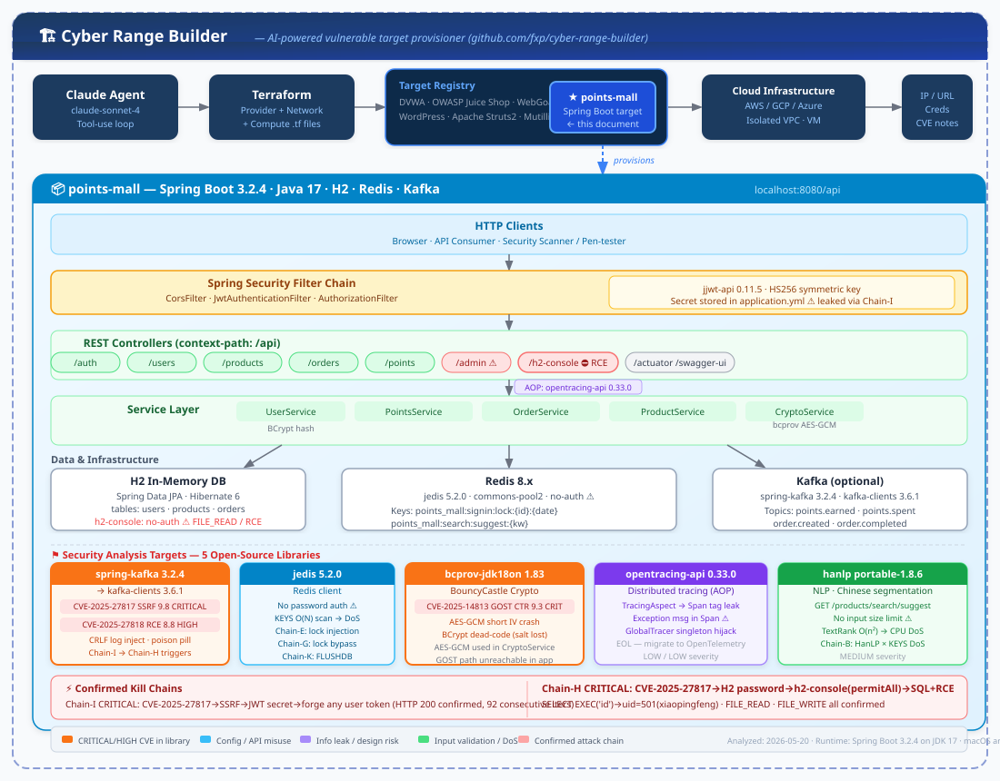

# 积分商城 — 分析 Agent 参考文档

## 系统架构

> 完整架构图展示了 points-mall 在 Cyber Range Builder 生态中的位置，以及内部分层结构和5个目标依赖库的安全分析重点。



---

## 概述

本项目是一个用于 **Cyber Range 扫描测试**的目标系统，基于 Spring Boot 构建的积分商城后端。包含用户管理、积分体系、商品目录、订单兑换等完整业务模块，并集成了五个指定的开源依赖库。

---

## 仓库信息

| 项目 | 地址 |
|------|------|
| GitHub 仓库 | https://github.com/fxp/cyber-range-builder |
| 积分商城分支 | `feature/points-mall-target` |
| 项目子目录 | `points-mall/` |

```bash
git clone https://github.com/fxp/cyber-range-builder.git
cd cyber-range-builder
git checkout feature/points-mall-target
cd points-mall
```

---

## 环境要求

| 依赖 | 版本 | 说明 |
|------|------|------|
| Java | 17 | `export JAVA_HOME=/opt/homebrew/opt/openjdk@17` |
| Maven | 3.9+ | `brew install maven` |
| Redis | 可选 | 无 Redis 时缓存操作静默跳过 |
| Kafka | 可选 | 无 Kafka 时消息发送静默失败，不影响启动 |

---

## 启动方式

```bash
# 设置 Java 17（macOS Homebrew）
export JAVA_HOME=/opt/homebrew/opt/openjdk@17
export PATH="$JAVA_HOME/bin:$PATH"

# 进入项目目录
cd points-mall

# 首次启动（下载依赖约 2 分钟，后续约 40 秒）
mvn spring-boot:run
```

看到以下日志表示启动成功：
```
Started PointsMallApplication in XX seconds
```

---

## 访问地址

| 地址 | 说明 |
|------|------|
| `http://localhost:8080/api/swagger-ui/index.html` | **Swagger UI 接口文档（推荐）** |
| `http://localhost:8080/api/v3/api-docs` | OpenAPI JSON |
| `http://localhost:8080/api/h2-console` | H2 数据库控制台（JDBC URL: `jdbc:h2:mem:pointsmall`，用户名: `sa`，密码: `password`） |
| `http://localhost:8080/api/actuator/health` | 健康检查 |

---

## 测试账号

| 用户名 | 密码 | 积分 | 等级 |
|--------|------|------|------|
| `testuser` | `test123456` | 5000 | SILVER |
| `admin` | `admin123` | 10000 | GOLD |

---

## API 接口列表

所有接口均以 `/api` 为前缀。需要认证的接口在 Header 中携带：
```
Authorization: Bearer <token>
```

### 认证（无需 token）

| 方法 | 路径 | 说明 |
|------|------|------|
| POST | `/auth/login` | 登录，返回 JWT token |
| POST | `/auth/register` | 注册新用户 |

**登录示例：**
```bash
curl -X POST http://localhost:8080/api/auth/login \
  -H "Content-Type: application/json" \
  -d '{"username":"testuser","password":"test123456"}'
```

### 用户（需要 token）

| 方法 | 路径 | 说明 |
|------|------|------|
| GET | `/users/me` | 获取当前用户信息 |
| PUT | `/users/me` | 更新个人资料（realName/phone/avatarUrl） |
| POST | `/users/me/password` | 修改密码 |

### 积分（需要 token）

| 方法 | 路径 | 说明 |
|------|------|------|
| GET | `/points/balance` | 查询积分余额 |
| POST | `/points/signin` | 每日签到（+5 积分） |
| GET | `/points/history` | 积分流水记录（分页） |

### 商品（无需 token）

| 方法 | 路径 | 说明 |
|------|------|------|
| GET | `/products` | 商品列表（分页，支持 `?category=VIRTUAL\|PHYSICAL\|COUPON\|EXPERIENCE\|CHARITY`） |
| GET | `/products/{id}` | 商品详情 |
| GET | `/products/hot` | 热销 TOP10 |
| GET | `/products/search?keyword=` | 中文关键词搜索（HanLP 分词） |
| GET | `/products/search/suggest?keyword=` | 搜索联想词 |

### 订单（需要 token）

| 方法 | 路径 | 说明 |
|------|------|------|
| POST | `/orders` | 创建订单（积分兑换商品） |
| GET | `/orders` | 我的订单列表（分页） |
| GET | `/orders/{orderNo}` | 订单详情 |
| POST | `/orders/{orderNo}/cancel` | 取消订单（退还积分） |

**下单示例：**
```bash
curl -X POST http://localhost:8080/api/orders \
  -H "Authorization: Bearer <token>" \
  -H "Content-Type: application/json" \
  -d '{
    "items": [{"productId": 1, "quantity": 1}],
    "receiverName": "张三",
    "receiverPhone": "13800000000",
    "shippingAddress": "北京市朝阳区xxx"
  }'
```

### 管理员（需要 ADMIN 角色）

| 方法 | 路径 | 说明 |
|------|------|------|
| POST | `/admin/products` | 创建商品 |
| PUT | `/admin/products/{id}` | 更新商品 |
| POST | `/admin/orders/{orderNo}/complete` | 标记订单完成 |
| POST | `/admin/points/grant` | 给用户赠送积分 |

---

## 集成依赖说明

| 依赖 | 版本 | 集成位置 | 用途 |
|------|------|----------|------|
| `spring-kafka` | 3.2.4 | `kafka/PointsEventProducer.java`<br>`kafka/PointsEventConsumer.java` | 积分变更、订单创建/完成事件发布与消费 |
| `jedis` | 5.2.0 | `cache/CacheService.java`<br>`config/RedisConfig.java` | 用户信息缓存、商品缓存、签到分布式锁 |
| `opentracing-api` | 0.33.0 | `tracing/TracingAspect.java`<br>`config/TracingConfig.java` | AOP 切面自动 trace 所有 Service 方法调用 |
| `bcprov-jdk18on` | 1.83 | `crypto/CryptoService.java` | AES-GCM 加解密、EC 密钥对生成与签名、SHA-256 哈希、BCrypt |
| `hanlp` | portable-1.8.6 | `search/ProductSearchService.java` | 商品搜索中文分词、关键词提取、摘要生成、拼音转换 |

---

## 代码结构

```
points-mall/src/main/java/com/cyberrange/pointsmall/
├── PointsMallApplication.java          # 启动入口
├── config/
│   ├── SecurityConfig.java             # Spring Security + JWT 配置
│   ├── JwtAuthenticationFilter.java    # JWT 请求过滤器
│   ├── KafkaConfig.java                # Kafka Topic 定义
│   ├── RedisConfig.java                # Jedis 连接池配置
│   ├── TracingConfig.java              # OpenTracing NoopTracer 注册
│   ├── AspectConfig.java               # 启用 AOP
│   ├── OpenApiConfig.java              # Swagger UI 配置
│   └── DataInitializer.java            # 初始化测试数据
├── controller/
│   ├── AuthController.java             # /auth/**
│   ├── UserController.java             # /users/**
│   ├── ProductController.java          # /products/**
│   ├── OrderController.java            # /orders/**
│   ├── PointsController.java           # /points/**
│   └── AdminController.java            # /admin/**
├── service/
│   ├── UserService.java
│   ├── ProductService.java
│   ├── OrderService.java
│   ├── PointsService.java
│   ├── JwtService.java
│   └── UserDetailsServiceImpl.java
├── model/
│   ├── User.java                       # 用户（含等级枚举 BRONZE~DIAMOND）
│   ├── Product.java                    # 商品（含分类/状态枚举）
│   ├── Order.java                      # 订单
│   ├── OrderItem.java                  # 订单行
│   └── PointsRecord.java               # 积分流水
├── repository/                         # Spring Data JPA Repository
├── cache/
│   └── CacheService.java               # Jedis 封装（get/set/hset/setNx 等）
├── crypto/
│   └── CryptoService.java              # BouncyCastle 加密工具
├── kafka/
│   ├── PointsEventProducer.java        # Kafka 消息生产者
│   └── PointsEventConsumer.java        # Kafka 消息消费者
├── search/
│   └── ProductSearchService.java       # HanLP 中文搜索服务
├── tracing/
│   └── TracingAspect.java              # OpenTracing AOP 切面
├── dto/                                # 请求/响应 DTO
└── exception/
    └── GlobalExceptionHandler.java     # 全局异常处理
```

---

## 数据模型

```
users ──< points_records
users ──< orders ──< order_items >── products
```

| 表 | 主要字段 |
|----|---------|
| `users` | id, username, password, email, total_points, available_points, level, status |
| `products` | id, name, description, points_price, stock, category, status, tags |
| `orders` | id, order_no, user_id, total_points, status, created_at |
| `order_items` | id, order_id, product_id, quantity, unit_points |
| `points_records` | id, user_id, points, balance_after, type, description, created_at |

---

## Kafka Topic

| Topic | 触发时机 |
|-------|---------|
| `points.earned` | 用户获得积分（购买、签到、管理员赠送等） |
| `points.spent` | 用户消费积分（兑换商品） |
| `order.created` | 订单创建成功 |
| `order.completed` | 订单标记完成 |

---

## 配置文件

主配置：`src/main/resources/application.yml`

关键配置项：

```yaml
server.port: 8080
spring.datasource: H2 内存数据库（无需外部依赖）
spring.kafka.bootstrap-servers: localhost:9092（可无 Kafka 启动）
redis.host: localhost:6379（可无 Redis 启动）
jwt.secret: points-mall-secret-key-for-jwt-signing-2024
jwt.expiration: 86400000（24小时）
```
